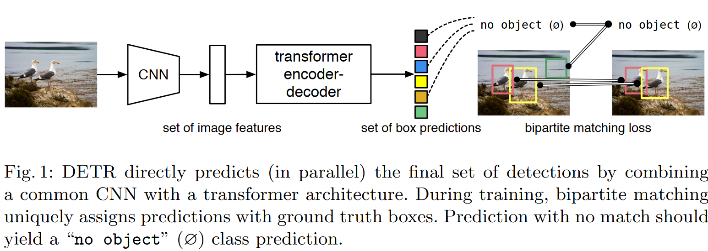

# End-to-End Object Detection with Transformers

## 模型
基于 CNN + Transformer 完全去除了以往检测算法对 nms、 anchor generator 等依赖于人工先验的后处理步骤，构造了一个完全 E2E 的检测框架。

DERT 的整体结构如下：

首先，图像经过一个 CNN backbone 得到 $C\times{H}\times{W}$ 的 feature map, 然后输入 Transformer 模块得到预测结果，最后将预测结果和 gt 做匹配并计算 bipartite matching loss。

在开始时，人为定义一个固定的 Transformer 输出长度N（需要大于图片中目标出现的最大数量），每一个输出包含一个可能目标的类别、中心点绝对坐标信息，如果目标数量小于 N，那么就把多余的位置置空（相当于传统检测算法里的背景类），gt 表示方法同理。得到预测序列和gt序列之后就可以使用匈牙利算法对预测和gt进行配对并计算loss了。匹配原理是寻找一个预测序列的排列$\sigma$，使得两个序列之间的$L_{match}$最小:

$$\hat{\sigma} = \arg \min \sum_i^N L_{match}(y_i, \hat{y}_{\sigma(i)}) \tag{1}$$

$$L_{match}(y_i, \hat{y}_{\sigma(i)}) = \\ -1_{c_i\neq \phi}\hat{p}_{\sigma{(i)}} + 1_{c_i\neq \phi}L_{box}(b_i, \hat{b}_{\sigma(i)})\tag{2}$$ 

找到最佳匹配排列之后就可以计算这个排列下的 loss 了:

$$L_{Hungarian}(y,\hat{y}) =  \\ \sum_{i=1}^N[-\log\hat{p}_{\hat{\sigma(i)}} + 1_{c_i\neq \phi}L_{box}(b_i, \hat{b}_{\hat{\sigma}}(i))] \tag{3}$$

为了缓解空目标的样本不平衡问题， 作者把空目标的 loss 缩小了 10 倍。

注意，由于这里的回归坐标采用的是绝对坐标，这样 L1 loss 就会随着物体大小而改变了，因此回归 loss 采用了 L1 + GIoU loss 的形式：

$$L_{box}(b_i, \hat{b}_{\hat{\sigma}}(i)) = \lambda_{iou}L_{iou}(b_i, \hat{b}_{\sigma(i)}) + \lambda_{L1} \left \| b_i - b_{\sigma(i)} \right \|_1 \tag{3}$$

另外，分类和回归 loss 都使用 batch 内的 object 数量做了 normalization。

可以看到，这里和传统检测算法最大的不同是这里的预测是1v1的预测，而传统检测方法是 1vn，这也是为什么能够抛弃 nms 的原因。

首先，输入图片( $3\times{H_o}\times{W_o}$ )经过 CNN backbone 得到分辨率较低的 feature maps ($C\times{H}\times{W}$), 然后进入到 Transformer 的 Encoder 部分，首先用 1x1 的 conv 把输入的 C 给降维到较小的 d ($d\times{H}\times{W}$) 并 reshape 到$d\times{HW}$，下面的结构就和标准的 Transformer Encoder 一样了（对输入拼上 position encoding）然后经过若干个 multi-head attention + FFN 的组合。 Decoder 部分和标准 Transformer 大体上是一样的，不过这里是并行处理 N 个 objects 而不像原始 Transformer 一样序列化处理，所以这里的 object queries (长度为 N 的 position encoding) 是加在每一个 masked multi-head attention + multi-head attention + FFN sublayer 上的。最后 decoder 的输出给到 N 个共享权重的 FFN 得到预测目标的类别和坐标信息。

## Ablations
1. encoder 层的数量很重要：减少 encoder 层数会有明显掉点，当没有 Encoder AP 会掉 3.9 个点， 大目标会掉 6 个点。
2. Encoder 关注全局信息，decoder 关注局部信息：可视化 Encoder 输出发现它可以将不同 instances 分开，而 decoder 在 Encoder 已经区分开 instance 的情况下只要关注于局部信息来预测它的类别和框就行。
3. FFP 很重要：拿掉的话会掉 2.3 个点。
4. position encoding 很重要：拿掉会掉 7.8 个点，因为模型得依靠它知道输入间的位置关系，起到类似 anchor 的作用。
5. GIoU loss 很重要：没有的话会掉 5 个点 1.

## 总结
1. 去掉了 nms anchor，实现了完全的 E2E
2. 训练效率不高、资源占用很大，不过最近已经有 Deformable DERT 等工作进行优化。