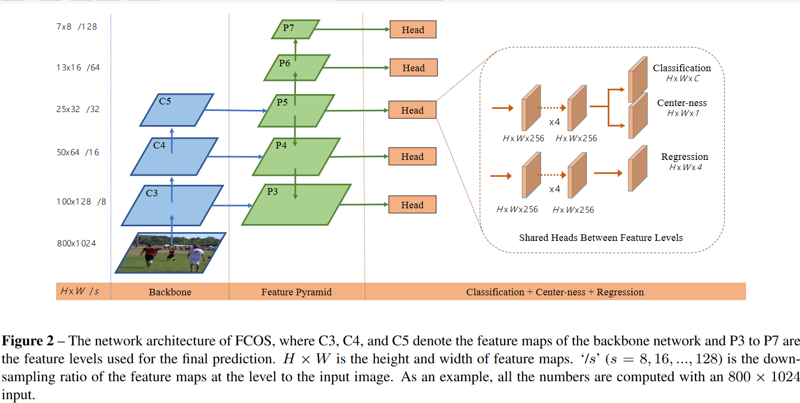
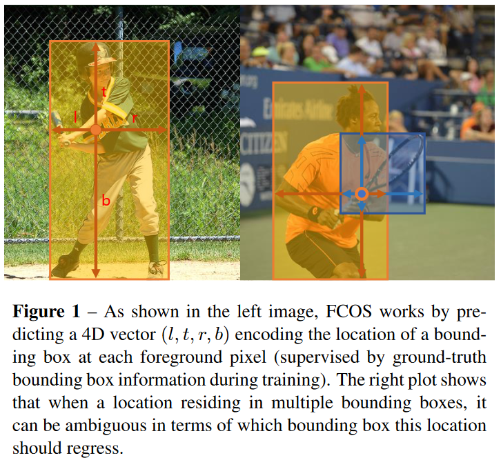
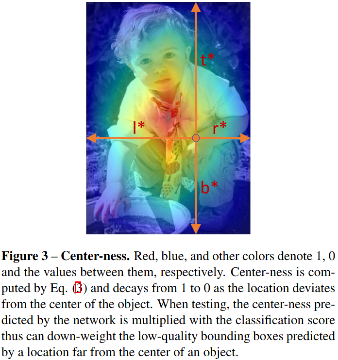

# FCOS: Fully Convolutional One-Stage Object Detection

## 0. 概述

FCOS是一个基于FCN的per-pixel、anchor free的one-stage目标检测算法，论文全称是《FCOS: Fully Convolutional One-Stage Object Detection》。

目前目标检测主要分为anchor-based和anchor-free两大流派。

**Anchor-based的缺点**

主流的检测器比如Faster R-CNN, SSD, YOLOv2,v3都是anchor-based的，也就是提前定义好框的大小，再用这个框在全图扫描寻找目标点。

但anchor-based的检测器有一些缺点：

1） 框的大小、宽高比、不同框的数量，这些超参对检测器的效果影响很大。例如在COCO数据集上对RetinaNet调整这些超参，最高可上影响4%的AP。因此，这些超参需要很小心的去优化；

2） 就算很仔细的调整了上述这些超参，因为框的大小和宽高比都已经固定了，一些小目标比较难检测。并且碰到不同的场景任务时，还需要重新设计框的大小等，比较麻烦；

3） Anchor-based的方法为了得到尽可能高的召回率，需要很多anchor防止漏检。但这些框大部分都是负样本，这样会导致训练时正负样本很不均衡；

4） Anchor-based在判断正负样本时一般用IOU，从而也导致计算比较复杂。

**Anchor-free的现状**

Anchor-free的方法，也是FCOS的流派归属，就是不预先定义框，由网络自己回归出框来。最有名的anchor-free的检测器可能就是YOLOv1了，但YOLOv1因为只检测离中心点近的目标，导致召回率比较低（YOLOv2中提到过，所以YOLOv2还是用了anchor）。CornerNet需要比较复杂的后处理、DenseBox不太适合通用目标检测，并且对重叠目标检测不好。可以看到，大家都有些不足之处，那下面让我们看看作者提出来的FCOS有什么精妙之处呢？

## 1. FCOS的思想

先设定Fi是CNN backbone的第i层特征图，s是到这一层的总步长（stride）。输入图像的gt的bounding box（以下简称bbox）可被定义为{Bi}，其中Bi=（x0(i), y0(i), x1(i), y1(i), c(i)）。其中(x0(i), y0(i))，(x1(i), y1(i))是bbox左上和右下的坐标，c(i)是目标类别。

对于Fi上每个像素(x,y)，我们可以把它映射到原输入图像

$$ (\lfloor \frac{s}{2} \rfloor + xs, \lfloor \frac{s}{2} \rfloor+ ys)$$

在映射后的该点直接回归目标框，而不是把这个点看成目标框的中心点（映射到原输入图像上会有一定的偏移）。FCOS相当于把每个点看出训练的样本。

对于每个(x,y)，如果它落在gt的框里面，并且类别和gt的框的类别是一样的，那么就看成正样本(c*)，反之则是负样本(c*=0)。所以FCOS可以利用更多的foreground样本，不像Anchor-based的检测器，只把和gt有高IOU的anchor box当作正样本。

另外每个点还有一个4维向量

$$ t* = (l*, t*, r*, b*) $$

分别对应(x,y)到左、上、右、下的距离。因为这个距离应该总是正值，所以会做一个exp(x)来保证得到的都是正值。

作者说FCOS比流行的anchor-based的检测器（每个位置用9个anchor-based）要少了9倍的网络输出变量。（仿佛在提示我该鼓掌了）

损失函数

$$ L(\{P_{x,y}\}, \{t_{x,y}\}) = \frac{1}{N_{pos}} \sum_{x,y} L_{cls}(p_{x,y}, c*_{x,y}) \\ + \frac{\lambda}{N_{pos}} \sum_{x,y} 1_{c*_{x,y}>0}L_{reg}(t_{x,y},t*_P{x,y}) $$

Lcls是分类的损失，用的focal loss。Lreg是回归框的损失，用的IOU。Npos是正样本的数量，λ文中用的是1，调整权重用。求和操作的话，是会对Fi上每个点都做的。

$$1_{c*_{x,y}>0}$$

表示对正样本做推理时，FCOS会选择px,y > 0.05的当作正样本，来获取预测的框。

FCOS的网络结构如上图所示。沿用FPN的思想，在不同层特征图检测不同大小的特征。P3，P4，P5是由CNN backbone的特征图C3,C4,C5跟一个1*1的卷积网络生成的，从上至下连接。P6，P7是分别由P5和P6精一个卷积层（stride=2）生成的。所以feature level P3、P4到P7对应的步长是8,16到128。

Anchor-based的检测器，一般将不同大小的anchor box指定给不同的feature level。FCOS则是直接对不同feature level限制bbox不同的范围。如果一个像素点的

$$ max(l*, t*, r*, b*) > m_i \\ \text{or $ max(l*, t*, r*, b*) < m_{i-1}$}$$

则认为它是负样本，不需要再回归框了。mi在这里指代的是第i层feature level最大需要回归的长度。在论文中，m2、m3、m4至m7分别取0、64、128至正无穷。

看到这里的小可爱们，不知道你们心中是否有这个疑问：为什么要设计分层呢？这样设计有什么好处呢？

这是为了解决像素点目标重叠的问题，如图2右。

一般大部分重叠都是发生在目标大小差别比较大的情况。那如果这个像素点就是好巧不巧有几个gt的框呢？论文中就是直接取最小的gt框作为目标。

不同的feature level需要回归不同大小的bbox，所以不同的feature level也不应该用完全相同的head。所以论文中用exp(six)来代替了常规的exp(x)，si是可训练的可自动调节指数底。

细心的朋友一定发现图1中classification下面还多了一个center-ness分支。这是什么呢？

Center-ness表示的是(x,y)距目标中心的标准化后的距离，为了制止过多的低质量离目标中心远的检测框而设计。

计算方式如下：

$$\text{cneterness}* = \sqrt{\frac{min(l*, r*)}{max(l*, r*)} \times \frac{min(t*,b*)}{max(t*, b*)}}$$

注：加Sqrt是为了减缓center-ness的衰减速度

图3 红色到蓝色表示center-ness从1到0

因为center-ness是在0-1之间，所以用的BCE loss，这个loss会一起加到上面我们提到的loss function中。在测试时，检测框的排序分数由center-ness乘上分类的分数。如果还有低质量的框，最后可用NMS来剔除。

## 总结

FCOS提供了可与anchor-based方法媲美的检测效果。避免了所以和anchor box相关的计算、超参的优化。用per-pixel的方法解决了目标检测的问题，与其他密集的预测任务比如语义分割类似，其思想或可借鉴。FCOS也可在two-stage的检测器中当作RPNs来使用。