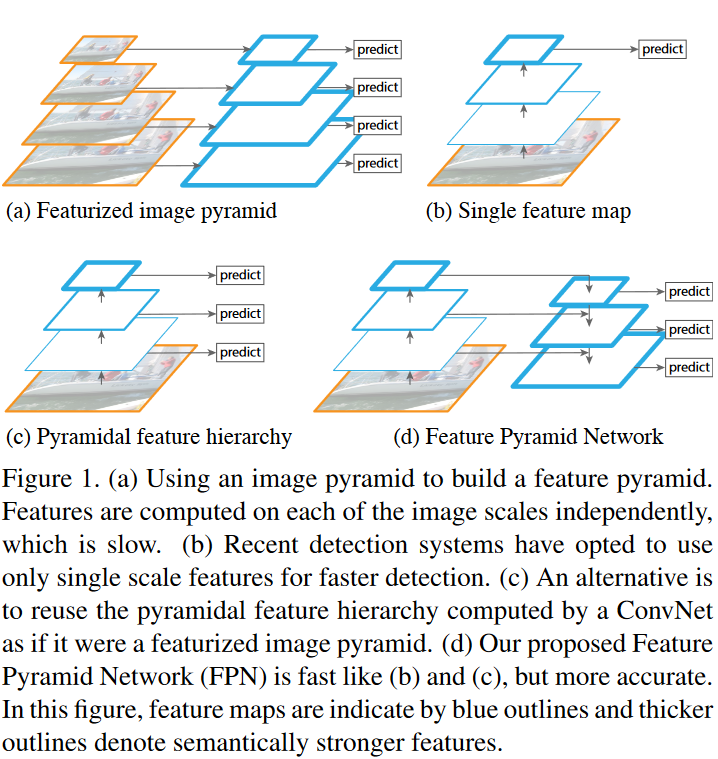
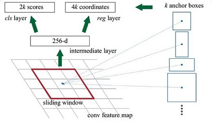
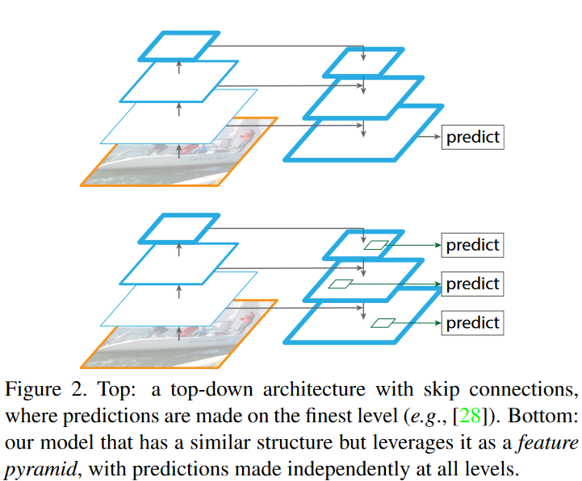
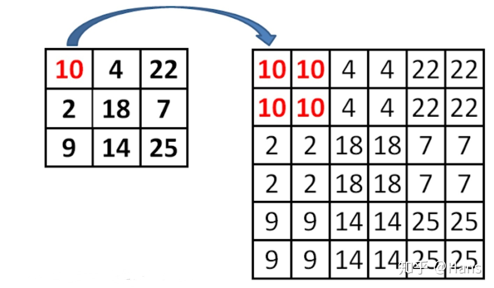
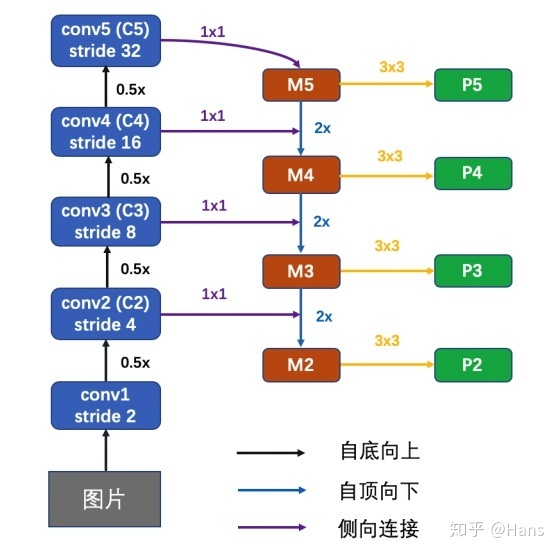

# Feature Pyramid Networks for Object Detection
 
>《Feature Pyramid Networks for Object Detection》这篇论文主要解决的问题是目标检测在处理多尺度变化问题是的不足，现在的很多网络都使用了利用单个高层特征(比如说Faster R-CNN利用下采样四倍的卷积层——Conv4，进行后续的物体的分类和bounding box的回归)，但是这样做有一个明显的缺陷，即小物体本身具有的像素信息较少，在下采样的过程中极易被丢失，为了处理这种物体大小差异十分明显的检测问题，经典的方法是利用图像金字塔的方式进行多尺度变化增强，但这样会带来极大的计算量。所以这篇论文提出了特征金字塔的网络结构，能在增加极小的计算量的情况下，处理好物体检测中的多尺度变化问题。

## 0. Abstract
这篇论文提出了一个利用深度卷积神经网络固有的多尺度金字塔结构来以极小的计算量构建特征金字塔的网络结构。

这是一种具有侧向连接（lateral connections）的自上而下的网络结构，用来构建不同尺寸的具有高级语义信息的特征图。

## 1. Introduction
总所周知，识别尺寸差异很大的物体是计算机视觉所面临的基本挑战之一。

这篇论文总结出针对这个问题的几种解决方法：

### (a). Feature pyramids built upon image pyramids ( featurized image pyramid）

通过图像金字塔来构建不同尺度的特征金字塔。

这种方法的优点有：

1. 对每一种尺度的图像进行特征提取，能够产生多尺度的特征表示，并且所有等级的特征图都具有较强的语义信息，甚至包括一些高分辨率的特征图。

这种方法的缺点有：

1. 推理时间大幅度增加；
2. 由于内存占用巨大，用图像金字塔的形式训练一个端到端的深度神经网络变得不可行；
3. 如果只在测试阶段使用图像金字塔，那么会造成一个问题：由于训练时，网络只是针对于某一个特点的分辨率进行训练，推理时运用图像金字塔，可能会在训练与推理时产生“矛盾”

### (b). 常见的目标检测网络

利用单个高层特征图进行预测。

例如Faster R-CNN中的RPN层就是利用单个高层特征图进行物体的分类和bounding box的回归。

### (c). 金字塔型特征层级 ConvNet's pyramidal feature hierarchy

比如SSD one-stage目标检测模型就是再次利用不同层多尺度的特征图。

但是SSD并没有解决以下问题：

低层特征图语义信息不够和低层特征图的分辨率也不高。

论文中指出，SSD为了避免使用低层特征图，放弃了重用已经计算的层，而是从网络的高层开始构建金字塔（例如，VGG网络的Conv4之后，再添加几个新的卷积层），因此，SSD错过了重用低层高分辨的特征图，即没有充分利用到低层特征图中的空间信息(这些信息对小物体的检测十分重要)。

SSD真实网络结构如下：

### (d). 特征金字塔 Feature Pyramid Networks

为了解决以上三种结构的不足之处，这篇论文提出了FPN，即使每一层不同尺度的特征图都具有较强的语义信息。

这种网络结构，能够在增加较少计算量的前提下融合低分辨率语义信息较强的特征图和高分辨率语义信息较弱但空间信息丰富的特征图。

其实在这篇论文之前，也有人提到得出一张既具有高分辨率又具有较强语义信息的特征图进行预测，但FPN的独特之处在于，它是在以特征金字塔为基础结构上，对每一层级的特征图分别进行预测。

## 3.FPN网络详解
论文中网络结构图：

### (1). Bottom-up pathway

前馈Backbone的一部分，每一级往上用step=2的降采样。

输出size相同的网络部分叫一级(stage)，选择每一级的最后一层特征图，作为Up-bottom pathway的对应相应层数，经过1 x 1卷积过后element add的参考。

例如，下图是fasterRCNN的网络结构，左列ResNet用每级最后一个Residual Block的输出，记为{C1,C2,C3,C4,C5}。

FPN用2~5级参与预测(因为第一级的语义还是太低了)，{C2,C3,C4,C5}表示conv2，conv3，conv4和conv5的输出层(最后一个残差block层)作为FPN的特征，分别对应于输入图片的下采样倍数为{4，8，16，32}。

### (2). Top-down pathway and lateral connections

自顶向下的过程通过上采样(up-sampling)的方式将顶层的小特征图。放大到上一个stage的特征图一样的大小。

上采样的方法是最近邻插值法：

对于使用最近邻插值法的个人思考：使用最近邻值插值法，可以在上采样的过程中最大程度地保留特征图的语义信息(有利于分类)，从而与bottom-up 过程中相应的具有丰富的空间信息(高分辨率，有利于定位)的特征图进行融合，从而得到既有良好的空间信息又有较强烈的语义信息的特征图。

对于使用最近邻插值法的个人思考：使用最近邻值插值法，可以在上采样的过程中最大程度地保留特征图的语义信息(有利于分类)，从而与bottom-up 过程中相应的具有丰富的空间信息(高分辨率，有利于定位)的特征图进行融合，从而得到既有良好的空间信息又有较强烈的语义信息的特征图。

## 4. FPN应用于RPN层
Faster RCNN中的RPN是通过最后一层的特征来做的。最后一层的特征经过3x3卷积，得到256个channel的卷积层，再分别经过两个1x1卷积得到类别得分和边框回归结果。这里将特征层之后的RPN子网络称之为网络头部（network head）。对于特征层上的每一个点，作者用anchor的方式预设了9个框。这些框本身包含不同的尺度和不同的长款比例。

FPN针对RPN的改进是将网络头部应用到每一个P层。由于每个P层相对于原始图片具有不同的尺度信息，因此作者将原始RPN中的尺度信息分离，让每个P层只处理单一的尺度信息。具体的，对${32^2、64^2、128^2、256^2、512^2}$这五种尺度的anchor，分别对应到{P2、P3、P4、P5、P6}这五个特征层上。每个特征层都处理1:1、1:2、2:1三种长宽比例的候选框。P6是专门为了RPN网络而设计的，用来处理512大小的候选框。它由P5经过下采样得到。

另外，上述5个网络头部的参数是共享的。作者通过实验发现，网络头部参数共享和不共享两种设置得到的结果几乎没有差别。这说明不同层级之间的特征有相似的语义层次。这和特征金字塔网络的原理一致。