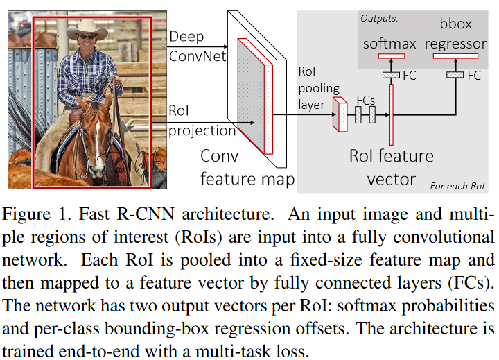

# Fast R-CNN

## 解决的问题：
之所以提出Fast R-CNN，主要是因为R-CNN存在以下几个问题：1、训练分多步。通过上一篇博文我们知道R-CNN的训练先要fine tuning一个预训练的网络，然后针对每个类别都训练一个SVM分类器，最后还要用regressors对bounding-box进行回归，另外region proposal也要单独用selective search的方式获得，步骤比较繁琐。2、时间和内存消耗比较大。在训练SVM和回归的时候需要用网络训练的特征作为输入，特征保存在磁盘上再读入的时间消耗还是比较大的。3、测试的时候也比较慢，每张图片的每个region proposal都要做卷积，重复操作太多。

虽然在Fast RCNN之前有提出过SPPnet算法来解决RCNN中重复卷积的问题，但是SPPnet依然存在和RCNN一样的一些缺点比如：训练步骤过多，需要训练SVM分类器，需要额外的回归器，特征也是保存在磁盘上。因此Fast RCNN相当于全面改进了原有的这两个算法，不仅训练步骤减少了，也不需要额外将特征保存在磁盘上。

基于VGG16的Fast RCNN算法在训练速度上比RCNN快了将近9倍，比SPPnet快大概3倍；测试速度比RCNN快了213倍，比SPPnet快了10倍。在VOC2012上的mAP在66%左右。

## 算法概要：
算法的主网络还是VGG16，按训练过程和测试过程来讲会清晰点。

**训练的过程：**

输入是224*224，经过5个卷积层和2个降采样层（这两个降采样层分别跟在第一和第二个卷积层后面）后，进入ROIPooling层，该层是输入是conv5层的输出和region proposal，region proposal的个数差不多2000。然后再经过两个都是output是4096的全连接层。最后分别经过output个数是21和84的两个全连接层（这两个全连接层是并列的，不是前后关系），前者是分类的输出，代表每个region proposal属于每个类别（21类）的得分，后者是回归的输出，代表每个region proposal的四个坐标。最后是两个损失层，分类的是softmaxWithLoss，输入是label和分类层输出的得分；回归的是SmoothL1Loss，输入是回归层的输出和target坐标及weight。

**测试的过程：**

与训练基本相同，最后两个loss层要改成一个softma层，输入是分类的score，输出概率。最后对每个类别采用NMS（non-maximun suppression）。

## 算法详解：
fast R-CNN的流程图如下，网络有两个输入：图像和对应的region proposal。其中region proposal由selective search方法得到，没有表示在流程图中。对每个类别都训练一个回归器，且只有非背景的region proposal才需要进行回归。

ROI pooling：ROI Pooling的作用是对不同大小的region proposal，从最后卷积层输出的feature map提取大小固定的feature map。简单讲可以看做是SPPNet的简化版本，因为全连接层的输入需要尺寸大小一样，所以不能直接将不同大小的region proposal映射到feature map作为输出，需要做尺寸变换。在文章中，VGG16网络使用H=W=7的参数，即将一个h*w的region proposal分割成H*W大小的网格，然后将这个region proposal映射到最后一个卷积层输出的feature map，最后计算每个网格里的最大值作为该网格的输出，所以不管ROI pooling之前的feature map大小是多少，ROI pooling后得到的feature map大小都是H*W。

因此可以看出Fast RCNN主要有3个改进：1、卷积不再是对每个region proposal进行，而是直接对整张图像，这样减少了很多重复计算。原来RCNN是对每个region proposal分别做卷积，因为一张图像中有2000左右的region proposal，肯定相互之间的重叠率很高，因此产生重复计算。2、用ROI pooling进行特征的尺寸变换，因为全连接层的输入要求尺寸大小一样，因此不能直接把region proposal作为输入。3、将regressor放进网络一起训练，每个类别对应一个regressor，同时用softmax代替原来的SVM分类器。

在实际训练中，每个mini-batch包含2张图像和128个region proposal（或者叫ROI），也就是每张图像有64个ROI。然后从这些ROI中挑选约25%的ROI，这些ROI和ground truth的IOU值都大于0.5。另外只采用随机水平翻转的方式增加数据集。
测试的时候则每张图像大约2000个ROI。

损失函数的定义是将分类的loss和回归的loss整合在一起，其中分类采用log loss，即对真实分类（下图中的pu）的概率取负log，而回归的loss和R-CNN基本一样。分类层输出K+1维，表示K个类和1个背景类。

$$L(p,u,t^u,v) = L_{cls}(p,u) + \lambda[u \geq 1]L_{loc}(t^u, v) \tag{1}$$

$$\text{in which $L_{cls}(p,u) = - logp_u$ is log loss for true class $u$}$$

这是回归的loss，其中t^u表示预测的结果，u表示类别。v表示真实的结果，即bounding box regression target。

采用SVD分解改进全连接层。如果是一个普通的分类网络，那么全连接层的计算应该远不及卷积层的计算，但是针对object detection，Fast RCNN在ROI pooling后每个region proposal都要经过几个全连接层，这使得全连接层的计算占网络的计算将近一半，如下图，所以作者采用SVD来简化全连接层的计算。另一篇博客链接讲的R-FCN网络则是对这个全连接层计算优化的新的算法。
