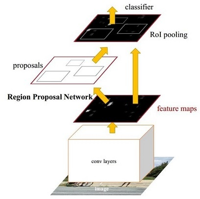
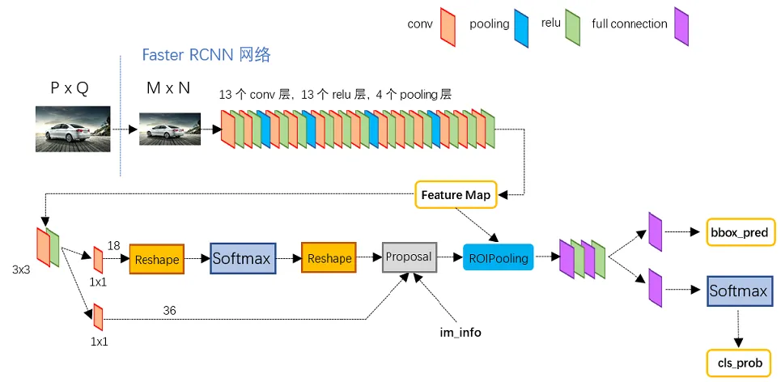
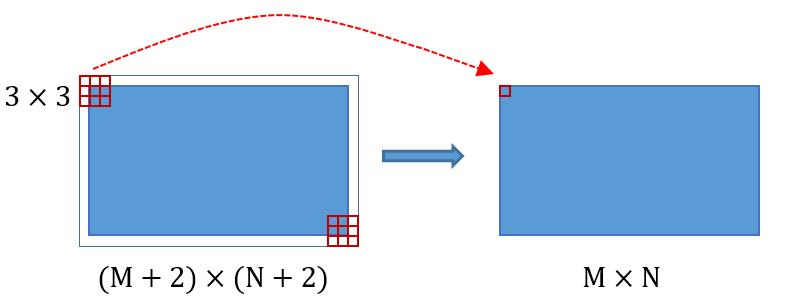
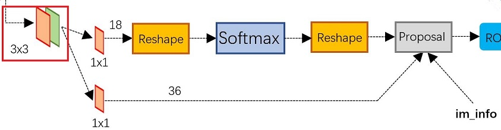
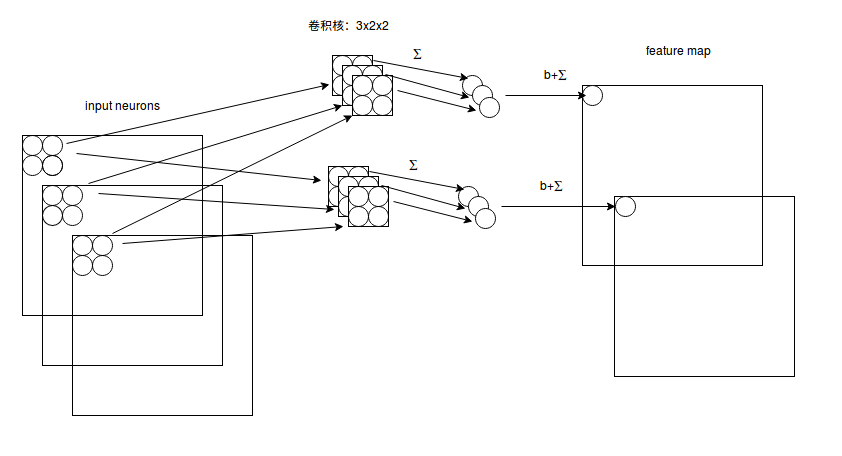
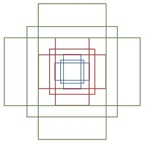

# 目标检测——以Faster R-CNN为例

## 一、目标检测

概述：分为定位任务（回归任务）和分类任务。

- 1.定位任务：将物体在图像中的位置检测出来。用(x,y,w,h)表示物体的位置，其中x，y是物体的中心点，w，h是目标物体框的长和宽。
- 2.分类：目标物体的类别。

## 二、目标检测的阶段

双阶段（Region Proposals）目标检测：指的是检测过程分为两步，提取物体的区域，对区域进行分类。

## 三、Faster R-CNN
概述：在结构上综合了特征抽取、proposal提取、bounding box回归、分类，性能上有很大的提高。

图1所示，faster r-cnn可以分为四个模块：
- 1.Conv. Layers。由卷积+激活+池化+（FPN）组成的特征提取网络，提取图像的feature maps。用于后续的RPN和全连接层。
- 2.RPN。RPN用于生成region proposals。该层通过softmax判断anchors属于positive或者是negative，再利用bounding box regression修正anchors获得精确的proposals。
- 3.RoI Pooling。该层输入feature maps和proposals，提取proposals对应的feature maps，送入后续全连接层判定目标类别。后面会接入NMS层减少proposals的数目
- 4.Classification。利用proposal feature maps计算proposals的类别，同时再次bounding box regression获得检测框最终的精确位置。

<em>3.1. Conv layers</em>

 

包含了conv，pooling，relu三种层。以python版本中的VGG16模型中的faster_rcnn_test.pt的网络结构为例，如图2，Conv layers部分共有13个conv层，13个relu层，4个pooling层。这里有一个非常容易被忽略但是又无比重要的信息，在Conv layers中：
·所有的conv层都是：kernel_size=3，pad=1，stride=1
·所有的pooling层都是：kernel_size=2，pad=0，stride=2
为何重要？在Faster RCNN Conv layers中对所有的卷积都做了扩边处理（ pad=1，即填充一圈0），导致原图变为 (M+2)x(N+2)大小，再做3x3卷积后输出MxN 。正是这种设置，导致Conv layers中的conv层不改变输入和输出矩阵大小。如图3：

下面是卷积输出大小的计算公式：

$$S_{\rm out}[t] = \begin{cases}W  \gets \lfloor \frac{W-F+2P}{S} + 1\rfloor\\
H \gets \lfloor \frac{H-F+2P}{S} + 1\rfloor\end{cases} \tag{1}$$

其中F是卷积核大小，P是补零，S是步长。
Conv layers中的pooling层kernel_size=2，stride=2。这样每个经过pooling层的MxN矩阵，都会变为(M/2)x(N/2)大小。综上所述，在整个Conv layers中，conv和relu层不改变输入输出大小，只有pooling层使输出长宽都变为输入的1/2。
那么，一个MxN大小的矩阵经过Conv layers固定变为(M/16)x(N/16)！这样Conv layers生成的feature map中都可以和原图对应起来。

<em>3.2.RPN</em>

 

经典检测方法生成检测框都非常**耗时**，如OpenCV adaboost使用滑动窗口+图像金字塔生成检测框；或如R-CNN使用SS(Selective Search)方法生成检测框。而Faster RCNN则抛弃了传统的滑动窗口和SS方法，直接使用RPN生成检测框，这也是Faster R-CNN的巨大优势，能极大提升检测框的生成速度。

3.2.1.多通道图像卷积

在介绍RPN前，还要多解释几句基础知识。
- 对于单通道图像+单卷积核做卷积，第一章中的图3已经展示了；
- 对于多通道图像+多卷积核做卷积，计算方式如下：

输入有3个通道，同时有2个卷积核。对于每个卷积核，先在输入3个通道分别作卷积，再将3个通道结果加起来得到卷积输出。所以对于某个卷积层，无论输入图像有多少个通道，输出图像通道数总是等于卷积核数量！

对多通道图像做1x1卷积，其实就是将输入图像于每个通道乘以卷积系数后加在一起，即相当于把原图像中本来各个独立的通道“联通”在了一起。

3.2.2. Anchors

Anchors是一系列矩形。其中每行4个值$(x_1, y_1, x_2, y_2)$表矩形左上和右下角点坐标。9个矩形共有3种形状，长宽比为大约为$width:height \in \{1:1,1:2,2:1\}$三种，如图6。实际上通过anchors就引入了检测中常用到的多尺度方法。

关于上面的anchors size，其实是根据检测图像设置的。在python demo中，会把任意大小的输入图像reshape成800x600（即图2中的M=800，N=600）。再回头来看anchors的大小，anchors中长宽1:2中最大为352x704，长宽2:1中最大736x384，基本是cover了800x600的各个尺度和形状。

那么这9个anchors是做什么的呢？借用Faster RCNN论文中的原图，如图7，遍历Conv layers计算获得的feature maps，为每一个点都配备这9种anchors作为初始的检测框。这样做获得检测框很不准确，不用担心，后面还有2次bounding box regression可以修正检测框位置。

解释下上面这张图的数字。
- 1.在原文中使用的是ZF model中，其Conv Layers中最后的conv5层num_output=256，对应生成256张特征图，所以相当于feature map每个点都是256-dimensions
- 2.在conv5之后，做了rpn_conv/3x3卷积且num_output=256，相当于每个点又融合了周围3x3的空间信息（猜测这样做也许更鲁棒？反正我没测试），同时256-d不变（如图4和图7中的红框）
- 3.假设在conv5 feature map中每个点上有k个anchor（默认k=9），而每个anhcor要分positive和negative，所以每个点由256d feature转化为cls=2•k scores；而每个anchor都有(x, y, w, h)对应4个偏移量，所以reg=4•k coordinates
- 4.补充一点，全部anchors拿去训练太多了，训练程序会在合适的anchors中随机选取128个postive anchors+128个negative anchors进行训练（什么是合适的anchors下文5.1有解释）

注意，在本文讲解中使用的VGG conv5 num_output=512，所以是512d，其他类似。
RPN最终就是在原图尺度上，设置了密密麻麻的候选Anchor。然后用cnn去判断哪些Anchor是里面有目标的positive anchor，哪些是没目标的negative anchor。所以，仅仅是个二分类而已！
那么Anchor一共有多少个？原图800x600，VGG下采样16倍，feature map每个点设置9个Anchor，所以：

$$\lfloor frac{800}{} \rfloor \times \lfloor \frac{600}{16} \times 9 = 50 \times 38 \times 9 = 17100 \tag{2}$$

