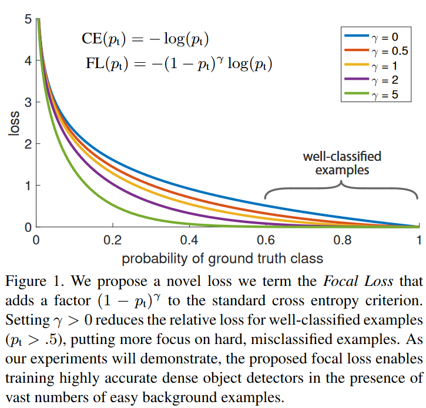
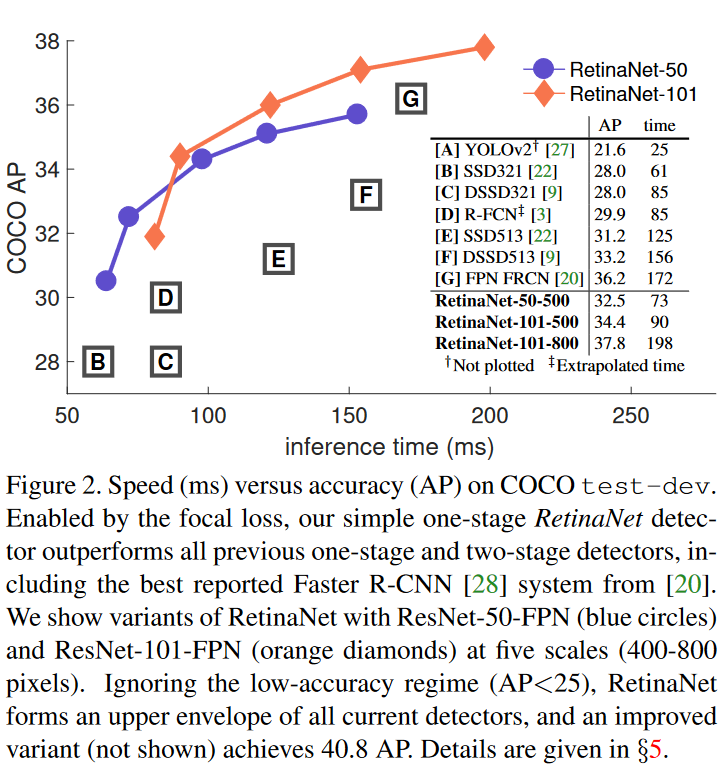
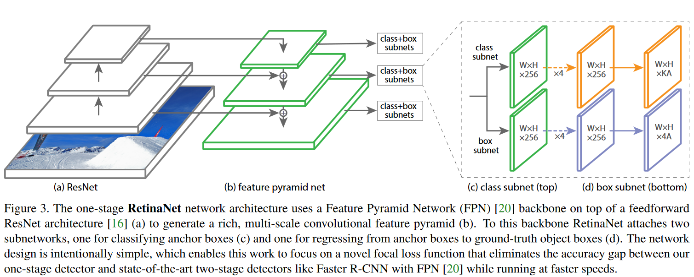
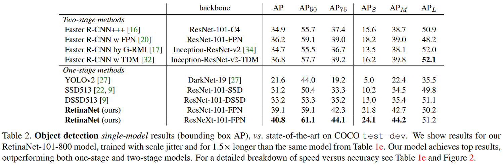
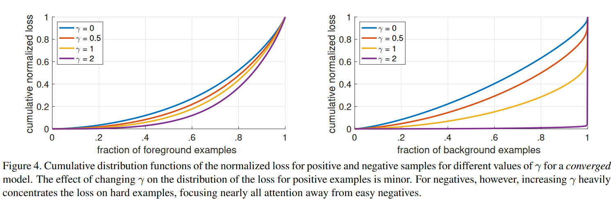

# Focal Loss for Dense Object Detection

## 1. 论文目标

我们知道object detection的算法主要可以分为两大类：two-stage detector和one-stage detector。前者是指类似Faster RCNN，RFCN这样需要region proposal的检测算法，这类算法可以达到很高的准确率，但是速度较慢。虽然可以通过减少proposal的数量或降低输入图像的分辨率等方式达到提速，但是速度并没有质的提升。后者是指类似YOLO，SSD这样不需要region proposal，直接回归的检测算法，这类算法速度很快，但是准确率不如前者。作者提出focal loss的出发点也是**希望one-stage detector可以达到two-stage detector的准确率，同时不影响原有的速度**。

## 2. 核心思想

既然有了出发点，那么就要找one-stage detector的准确率不如two-stage detector的原因，作者认为原因是：**样本的类别不均衡导致的**。我们知道在object detection领域，一张图像可能生成成千上万的candidate locations，但是其中只有很少一部分是包含object的，这就带来了类别不均衡。那么类别不均衡会带来什么后果呢？引用原文讲的两个后果：

(1) training is inefficient as most locations are easy negatives that contribute no useful learning signal;

(2) en masse, the easy negatives can overwhelm training and lead to degenerate models.

什么意思呢？**负样本数量太大**，占总的loss的大部分，而且多是容易分类的，因此使得模型的优化方向并不是我们所希望的那样。其实先前也有一些算法来处理类别不均衡的问题，比如[OHEM](OHEM.md)（online hard example mining），OHEM的主要思想可以用原文的一句话概括：In OHEM each example is scored by its loss, non-maximum suppression (nms) is then applied, and a minibatch is constructed with the highest-loss examples。OHEM算法虽然增加了错分类样本的权重，但是OHEM算法忽略了容易分类的样本。

因此针对类别不均衡问题，作者提出一种新的**损失函数**：focal loss，这个损失函数是在标准交叉熵损失基础上修改得到的。这个函数可以通过减少易分类样本的权重，使得模型在训练时更专注于难分类的样本。为了证明focal loss的有效性，作者设计了一个dense detector：**RetinaNet**，并且在训练时采用focal loss训练。实验证明RetinaNet不仅可以达到one-stage detector的速度，也能有two-stage detector的准确率。

介绍focal loss，在介绍focal loss之前，先来看看交叉熵损失，这里以二分类为例，原来的分类loss是各个训练样本交叉熵的直接求和，也就是各个样本的权重是一样的。公式如下：

$$ CE(p,y)=\left\{
\begin{aligned}
-log(p) & &\text{if $y = 1$}  \\
-log(1-p) &  &\text{otherwise.}
\end{aligned}
\right. \tag{1}
$$

因为是二分类，p表示预测样本属于1的概率（范围为0-1），y表示label，y的取值为{+1,-1}。当真实label是1，也就是y=1时，假如某个样本x预测为1这个类的概率p=0.6，那么损失就是-log(0.6)，注意这个损失是大于等于0的。如果p=0.9，那么损失就是-log(0.9)，所以p=0.6的损失要大于p=0.9的损失，这很容易理解。这里仅仅以二分类为例，多分类分类以此类推

为了方便，用pt代替p，如下公式2:。这里的pt就是前面Figure1中的横坐标。

$$ p_t=\left\{
\begin{aligned}
p & &\text{if $y = 1$}  \\
1-p &  &\text{otherwise.}
\end{aligned}
\right. \tag{2}
$$

为了表示简便，我们用p_t表示样本属于true class的概率。所以(1)式可以写成

$$CE(p,y) = CE(p_t) = -log(p_t) \tag{3}$$

接下来介绍一个最基本的对交叉熵的改进，也将作为本文实验的baseline，既然one-stage detector在训练的时候正负样本的数量差距很大，那么一种常见的做法就是给正负样本加上权重，负样本出现的频次多，那么就降低负样本的权重，正样本数量少，就相对提高正样本的权重。因此可以通过设定a的值来控制正负样本对总的loss的共享权重。a取比较小的值来降低负样本（多的那类样本）的权重。

$$CE(p_t) = - \alpha_t log(p_t) \tag{4}$$

显然前面的公式3虽然可以控制正负样本的权重，但是没法控制容易分类和难分类样本的权重，于是就有了focal loss： 

$$FL(p_t) = -(1-p_t)^\gamma log(p_t) \tag{5}$$

这里的γ称作focusing parameter，γ>=0。$(1-p_t)^\gamma$称为调制系数（modulating factor）

为什么要加上这个调制系数呢？目的是通过减少易分类样本的权重，从而使得模型在训练时更专注于难分类的样本。

绘制图看如下Figure1，横坐标是pt，纵坐标是loss。CE（pt）表示标准的交叉熵公式，FL（pt）表示focal loss中用到的改进的交叉熵。Figure1中γ=0的蓝色曲线就是标准的交叉熵损失。

1、当一个样本被分错的时候，pt是很小的，那么调制因子（1-Pt）接近1，损失不被影响；当Pt→1，因子（1-Pt）接近0，那么分的比较好的（well-classified）样本的权值就被调低了。因此调制系数就趋于1，也就是说相比原来的loss是没有什么大的改变的。当pt趋于1的时候（此时分类正确而且是易分类样本），调制系数趋于0，也就是对于总的loss的贡献很小。

2、当γ=0的时候，focal loss就是传统的交叉熵损失，当γ增加的时候，调制系数也会增加。 专注参数γ平滑地调节了易分样本调低权值的比例。γ增大能增强调制因子的影响，实验发现γ取2最好。直觉上来说，调制因子减少了易分样本的损失贡献，拓宽了样例接收到低损失的范围。当γ一定的时候，比如等于2，一样easy example(pt=0.9)的loss要比标准的交叉熵loss小100+倍，当pt=0.968时，要小1000+倍，但是对于hard example(pt < 0.5)，loss最多小了4倍。这样的话hard example的权重相对就提升了很多。这样就增加了那些误分类的重要性

focal loss的两个性质算是核心，其实就是用一个合适的函数去度量难分类和易分类样本对总的损失的贡献。

作者在实验中采用的是公式5的focal loss（结合了公式3和公式4，这样既能调整正负样本的权重，又能控制难易分类样本的权重）：

$$FL(p_t) = -\alpha_t(1-p_t)^\gamma log(p_t) \tag{6}$$

在实验中a的选择范围也很广，一般而言当γ增加的时候，a需要减小一点（实验中γ=2，a=0.25的效果最好）

Figure2是在COCO数据集上几个模型的实验对比结果。可以看看再AP和time的对比下，本文算法和其他one-stage和two-stage检测算法的差别。

提出了一个RetinaNet，采用的是Resnet+FPN作为backbone，cls和reg两路subnet分别加在各个Pyramid level上， Figure3。

**Anchors:**

作者用了translation-invariant anchor boxes 平移不变锚与RPN的变体相似。这个anchor在金字塔层P3到P7有相应的 32^2 到 512^2 的区域。在每个金字塔层，作者用的长宽比是{ 1:2，1:1,2:1 }。在每层，对于三个长宽比的anchor，加了anchor的形状的$\{ 2^0,2^\{1/3\}，2^\{2/3\} \}$的anchor。这能够增加AP。对于每层，有A=9个anchor，穿过这些层，它们可以覆盖32-813个输入图片中的像素。每个Anchor都是K个分类目标的one-hot向量（K是目标类别数）和4个box regression目标。作者设定anchor的方式是与ground-truth 的intersection-over-union (IoU) 阈值0.5，与背景IOU [0,0.4) 。所有的anchor都被设定为一个box，在预测向量的对应的类位置设1，其他的设为0。如果没有被设定，那么 $IoU\in[0.4,0.5)$ ,它是在训练时候被忽略的。Box regression targets是计算出来的每个anchor和它设定的object box的偏移量，如果没有设定那么忽略。

**Classification Subnet:**

分类子网络在每个空间位置，为A个anchor和K个类别，预测object presence的概率。这个子网络是小的FCN（全卷积网络），与FPN中的每层相接；这个子网络的参数在整个金字塔的层间共享。设计方法是：如果一个从金字塔某个层里来的feature map是C个通道，子网络使用 四个3*3 的卷积层，C个滤波器，每个都接着ReLU激活函数；接下来用 3*3 的卷积层，有 KA 个滤波器。最后用sigmoid激活函数对于每个空间位置，输出 KA 个binary预测。作者用实验中 C=256 A=9 。与RPN对比，作者的object classification子网络更深，只用 3*3 卷积，且不和box regression子网络共享参数。作者发现这种higer-level设计决定比超参数的特定值要重要。

**Box Regression Subnet:**

与object classification子网络平行，作者在金字塔每个层都接到一个小的FCN上，意图回归每个anchor box对邻近ground truth object的偏移量。回归子网络的设计和分类相同，不同的是它为每个空间位置输出4A个线性输出。对于每个空间位置的A个anchor，4个输出预测anchor和ground-truth box的相对偏移。与现在大多数工作不同的是，作者用了一个class-agnostic bounding box regressor，这样能用更少的参数更高效。Object classification和bounding box regression两个网络共享一个网络结构，但是分别用不同的参数。

**实验结果：**

Table1是关于RetinaNet和Focal Loss的一些实验结果(COCO上做的)。

（a）是在交叉熵的基础上加上参数a，a=0.5就表示传统的交叉熵，可以看出当a=0.75的时候效果最好，AP值提升了0.9。

（b）是对比不同的参数γ和a的实验结果，可以看出随着γ的增加，AP提升比较明显。对于固定的α，当γ等于2的时候能达到最高的AP

(c)不同的anchor的scale和aspect ratio，选择2scale,3aspect ratio效果最好

（d）通过和OHEM的对比可以看出最好的Focal Loss比最好的OHEM提高了3.2AP。这里OHEM1:3表示在通过OHEM得到的minibatch上强制positive和negative样本的比例为1:3，通过对比可以看出这种强制的操作并没有提升AP。

（e）作者对比了自己的模型在不同的深度和训练图像scale下的speed/accuracy。速度方面也有优势！

为了更好的观察focal loss在reweighting example的效果，作者随机选取了10^7个负样本window和10^5个正样本window，然后通过网络之后分别计算这些正负样本的loss，最后，分别对于正样本和负样本，把所有window的loss进行归一化(softmax)，画出累计loss随样本数目的增长曲线。Figure4是对比forground和background样本在不同γ情况下的累积误差。纵坐标是归一化后的损失，横坐标是总的foreground或background样本数的百分比。可以看出γ的变化对正（forground）样本的累积误差的影响并不大，但是对于负（background）样本的累积误差的影响还是很大的（γ=2时，将近99%的background样本的损失都非常小）。

## 3. Conclusion

作者将类别不平衡作为阻碍one-stage方法超过top-performing的two-stage方法的主要原因。为了解决这个问题，作者提出了focal loss，在交叉熵里面用一个调整项，为了将学习专注于hard examples上面，并且降低大量的easy negatives的权值。作者的方法简单高效。并且设计了一个全卷积的one-stage的方法来验证它的高效性。在具有挑战性的COCO数据集上面也达到了state-of-the-art的精度和运行时间。

