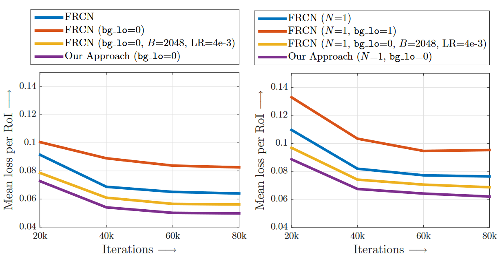

# Training Region-based Object Detectors with Online Hard Example Mining

**难的样本多学学**

## 快速一览
- 简单样本与难分辨样本之间的类别不平衡是亟需解决的问题
- 自动地选择难分辨样本来进行训练不仅效率高而且性能好
- 文章提出了OHEM算法，不仅效率高而且性能好，在各种数据集上表现优越

## Related work
- Hard Negative Mining，offline mining主要思想是逐渐地增加错误样本。然后再把错误样本加入到样本集中训练 ， 因此必须使用online方法
- 在Fast RCNN中如何判定前后背景呢。RoI（region of interest）与真实框的IOU大于等于0.5即判定为前景RoI
- Fast RCNN为了解决目标框和背景框之间的不平衡，采用随机降采样方法，保持bg和fg的比例是1：3。这样的一个比例对 于Fast R-CNN的性能是十分重要的，但使用OHEM便可以把这个比例值去掉。

## Algorithm
1. 正常进行一次Faster RCNN的前向传播，获得每个RoI单独的损失值;

2. 对RoIs进行NMS（因此作者发现位置上相邻的 RoIs 通过 RoI 网络后会输出相近的损失）；

3. 对nms之后剩下的RoIs按损失值进行排序，然后选用损失值最大的前一部分RoI当作输入再进一遍B部分，在原文描述如下：

> Hard examples are selected by sorting the input RoIs by loss and taking the B/N examples for which the current network performs worst.

通过这种方法，可以屏蔽掉loss值非常低的RoIs。模型训练很多次还对这些RoIs有着很高的loss，那么就认为这是困难负例。整体就是先计算loss->筛选->得到困难负例->回传梯度计算。如果OHEM筛选出的loss更低



## Coding

对于分类loss来说Coding比较简单，相当于是按照rate比例只取前百分之rate的loss进行回传

```python
def ohem(self, loss):
    if self.ohem_rate is not None:
        if loss.dim() >= 2:
            #增序排序后按照比例丢弃简单样本的loss
            index = torch.argsort(
                loss.sum(1))[int(loss.shape[0] * self.ohem_rate):]
            loss = loss[index, :]
        else:
            index = torch.argsort(loss)[int(loss.shape[0] * self.ohem_rate):]
            loss = loss[index]
    return loss
```

## 缺点

只处理了easy sample的问题，后续提出的OHEM 1：3，easy:hard筛选出的样本进行训练，考虑了类间平衡
简单粗暴，直接丢弃简单样本的loss不会回传，后续的FocalLoss考虑了每个样本，难易样本上的loss权重是根据样本难度计算出来的。下一篇继续介绍恺明的FocalLoss