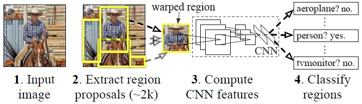
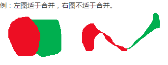
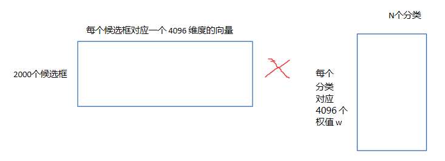
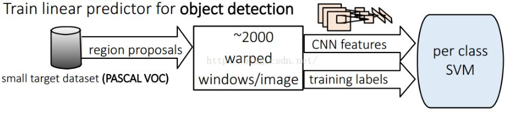

# Rich feature hierarchies for accurate object detection and semantic segmentation

<!--https://zhuanlan.zhihu.com/p/23006190-->

RCNN (论文：Rich feature hierarchies for accurate object detection and semantic segmentation) 是将CNN方法引入目标检测领域， 大大提高了目标检测效果，可以说改变了目标检测领域的主要研究思路， 紧随其后的系列文章：（RCNN）,Fast RCNN, Faster RCNN 代表该领域当前最高水准。

## 1. 历史意义

- 速度： 经典的目标检测算法使用滑动窗法依次判断所有可能的区域。本文则(采用**Selective Search**方法)预先提取一系列较可能是物体的候选区域，之后仅在这些候选区域上(采用CNN)提取特征，进行判断。
- 训练集： 经典的目标检测算法在区域中提取人工设定的特征。本文则采用深度网络进行特征提取。使用两个数据库： 一个较大的识别库（**ImageNet ILSVC 2012**）：标定每张图片中物体的类别。一千万图像，1000类。 一个较小的检测库（PASCAL VOC 2007）：标定每张图片中，物体的类别和位置，一万图像，20类。 本文使用识别库进行预训练得到CNN（有监督预训练），而后用检测库调优参数，最后在检测库上评测。

## 2. 基本流程

RCNN算法分为4个步骤

- 候选区域生成： 一张图像生成1K~2K个候选区域 （采用**Selective Search**方法）
- 特征提取： 对每个候选区域，使用深度卷积网络提取特征 （CNN）
- 类别判断： 特征送入每一类的SVM分类器，判别是否属于该类
- 位置精修： 使用回归器精细修正候选框位置

### 2.1. Selective Search主要思想

1. 使用一种过分割手段，将图像分割成小区域 (1k~2k 个)
2. 查看现有小区域，按照合并规则合并可能性最高的相邻两个区域。重复直到整张图像合并成一个区域位置
3. 输出所有曾经存在过的区域，所谓候选区域

其中合并规则如下： 优先合并以下四种区域：

- 颜色（颜色直方图）相近的
- 纹理（梯度直方图）相近的
- 合并后总面积小的： 保证合并操作的尺度较为均匀，避免一个大区域陆续“吃掉”其他小区域 （例：设有区域a-b-c-d-e-f-g-h。较好的合并方式是：ab-cd-ef-gh -> abcd-efgh -> abcdefgh。 不好的合并方法是：ab-c-d-e-f-g-h ->abcd-e-f-g-h ->abcdef-gh -> abcdefgh）

合并后，总面积在其BBOX中所占比例大的： 保证合并后形状规则。

上述四条规则只涉及区域的颜色直方图、梯度直方图、面积和位置。合并后的区域特征可以直接由子区域特征计算而来，速度较快。

## 3. 候选框搜索阶段

当我们输入一张图片时，我们要搜索出所有可能是物体的区域，这里采用的就是前面提到的Selective Search方法，通过这个算法我们搜索出2000个候选框。然后从上面的总流程图中可以看到，搜出的候选框是矩形的，而且是大小各不相同。然而CNN对输入图片的大小是有**固定**的，如果把搜索到的矩形选框不做处理，就扔进CNN中，肯定不行。因此对于每个输入的候选框都需要缩放到固定的大小。下面我们讲解要怎么进行缩放处理，为了简单起见我们假设下一阶段CNN所需要的输入图片大小是个正方形图片227x227。因为我们经过selective search 得到的是矩形框，paper试验了两种不同的处理方法：

### 3.1. 各向异性缩放

这种方法很简单，就是不管图片的长宽比例，管它是否扭曲，进行缩放就是了，全部缩放到CNN输入的大小227*227，如下图(D)所示；

### 3.2. 各向同性缩放

因为图片扭曲后，估计会对后续CNN的训练精度有影响，于是作者也测试了“各向同性缩放”方案。有两种办法

A、先扩充后裁剪： 直接在原始图片中，把bounding box的边界进行扩展延伸成正方形，然后再进行裁剪；如果已经延伸到了原始图片的外边界，那么就用bounding box中的颜色均值填充；如上图(B)所示;

B、先裁剪后扩充：先把bounding box图片裁剪出来，然后用固定的背景颜色填充成正方形图片(背景颜色也是采用bounding box的像素颜色均值),如上图(C)所示;

对于上面的异性、同性缩放，文献还有个padding处理，上面的示意图中第1、3行就是结合了padding=0,第2、4行结果图采用padding=16的结果。经过最后的试验，作者发现采用各向异性缩放、padding=16的精度最高。

（备注：候选框的搜索策略作者也考虑过使用一个滑动窗口的方法，然而由于更深的网络，更大的输入图片和滑动步长，使得使用滑动窗口来定位的方法充满了挑战。）

## 4. CNN特征提取阶段：

### 4.1. 算法实现

a、网络结构设计阶段

网络架构两个可选方案：第一选择经典的Alexnet；第二选择VGG16。经过测试Alexnet精度为58.5%，VGG16精度为66%。VGG这个模型的特点是选择**比较小的卷积核、选择较小的跨步**，这个网络的精度高，不过计算量是Alexnet的7倍。后面为了简单起见，我们就直接选用Alexnet，并进行讲解；Alexnet特征提取部分包含了5个卷积层、2个全连接层，在Alexnet中p5层神经元个数为9216、 f6、f7的神经元个数都是4096，通过这个网络训练完毕后，最后提取特征每个输入候选框图片都能得到一个4096维的特征向量。

b、网络有监督预训练阶段 （图片数据库：ImageNet ILSVC ）

参数初始化部分：物体检测的一个难点在于，物体标签训练数据少，如果要直接采用随机初始化CNN参数的方法，那么目前的训练数据量是远远不够的。这种情况下，最好的是采用某些方法，把参数初始化了，然后在进行有监督的参数微调，这里文献采用的是有监督的预训练。所以paper在设计网络结构的时候，是直接用Alexnet的网络，然后连参数也是直接采用它的参数，作为初始的参数值，然后再fine-tuning训练。网络优化求解时采用随机梯度下降法，学习率大小为0.001；

C、fine-tuning阶段 （图片数据库： PASCAL VOC）

我们接着采用 selective search 搜索出来的候选框 （PASCAL VOC 数据库中的图片） 继续对上面预训练的CNN模型进行fine-tuning训练。假设要检测的物体类别有N类，那么我们就需要把上面预训练阶段的CNN模型的最后一层给替换掉，替换成N+1个输出的神经元(**加1，表示还有一个背景**) (20 + 1bg = 21)，然后这一层直接采用参数随机初始化的方法，其它网络层的参数不变；接着就可以开始继续SGD训练了。开始的时候，SGD学习率选择0.001，在每次训练的时候，我们batch size大小选择128，其中32个是正样本、96个是负样本。

关于正负样本问题：

> 一张照片我们得到了2000个候选框。然而人工标注的数据一张图片中就只标注了正确的bounding box，我们搜索出来的2000个矩形框也不可能会出现一个与人工标注完全匹配的候选框。因此在CNN阶段我们需要用IOU为2000个bounding box打标签。如果用selective search挑选出来的候选框与物体的人工标注矩形框（PASCAL VOC的图片都有人工标注）的**重叠区域IoU**大于0.5，那么我们就把这个候选框标注成物体类别（正样本），否则我们就把它当做背景类别（负样本）。
> （备注： 如果不针对特定任务进行fine-tuning，而是把CNN当做特征提取器，卷积层所学到的特征其实就是基础的共享特征提取层，就类似于SIFT算法一样，可以用于提取各种图片的特征，而f6、f7所学习到的特征是用于针对特定任务的特征。打个比方：对于人脸性别识别来说，一个CNN模型前面的卷积层所学习到的特征就类似于学习人脸共性特征，然后全连接层所学习的特征就是针对性别分类的特征了）

### 4.2. 疑惑点

CNN训练的时候，本来就是对bounding box的物体进行识别分类训练，在训练的时候最后一层softmax就是分类层。那么为什么作者闲着没事干要先用CNN做特征提取（提取fc7层数据），然后再把提取的特征用于训练svm分类器？

**这个是因为svm训练和cnn训练过程的正负样本定义方式各有不同**，导致最后采用CNN softmax输出比采用svm精度还低。事情是这样的，cnn在训练的时候，对训练数据做了比较宽松的标注，比如一个bounding box可能只包含物体的一部分，那么我也把它标注为正样本，用于训练cnn；采用这个方法的主要原因在于因为**CNN容易过拟合**，所以需要**大量的训练数据**，所以在CNN训练阶段我们是对Bounding box的位置限制条件限制的比较松(IOU只要大于0.5都被标注为正样本了)；然而svm训练的时候，因为svm适用于少样本训练，所以对于训练样本数据的IOU要求比较严格，我们只有当bounding box把整个物体都包含进去了，我们才把它标注为物体类别，然后训练svm，具体请看下文。

**SVM训练、测试阶段**

训练阶段：

这是一个二分类问题，我么假设我们要检测车辆。我们知道只有当bounding box把整量车都包含在内，那才叫正样本；如果bounding box 没有包含到车辆，那么我们就可以把它当做负样本。但问题是当我们的检测窗口只有部分包含物体，那该怎么定义正负样本呢？作者测试了IOU阈值各种方案数值0,0.1,0.2,0.3,0.4,0.5。最后通过训练发现，如果选择IOU阈值为0.3效果最好（选择为0精度下降了4个百分点，选择0.5精度下降了5个百分点）,即当重叠度小于0.3的时候，我们就把它标注为负样本。一旦CNN f7层特征被提取出来，那么我们将为每个物体类训练一个svm分类器。当我们用CNN提取2000个候选框，可以得到2000x4096这样的特征向量矩阵，然后我们只需要把这样的一个矩阵与svm权值矩阵4096xN点乘(N为分类类别数目，因为我们训练的N个svm，每个svm包含了4096个权值w)，就可以得到结果了。

得到的特征输入到SVM进行分类看看这个feature vector所对应的region proposal是需要的物体还是无关的实物(background) 。 排序，canny边界检测之后就得到了我们需要的bounding-box。

> 再回顾总结一下：整个系统分为三个部分：1.产生不依赖与特定类别的region proposals，这些region proposals定义了一个整个检测器可以获得的候选目标2.一个大的卷积神经网络，对每个region产生一个固定长度的特征向量3.一系列特定类别的线性SVM分类器。

位置精修： 目标检测问题的衡量标准是重叠面积：许多看似准确的检测结果，往往因为候选框不够准确，重叠面积很小。故需要一个位置精修步骤。 回归器：对每一类目标，使用一个线性脊回归器进行精修。正则项λ=10000。 输入为深度网络pool5层的4096维特征，输出为xy方向的缩放和平移。 训练样本：判定为本类的候选框中和真值重叠面积大于0.6的候选框。

测试阶段：

使用selective search的方法在测试图片上提取2000个region propasals ，将每个region proposals归一化到227x227，然后再CNN中正向传播，将最后一层得到的特征提取出来。然后对于每一个类别，使用为这一类训练的SVM分类器对提取的特征向量进行打分，得到测试图片中对于所有region proposals的对于这一类的分数，再使用贪心的非极大值抑制（NMS）去除相交的多余的框。再对这些框进行canny边缘检测，就可以得到bounding-box(then B-BoxRegression)。

（非极大值抑制（NMS）先计算出每一个bounding box的面积，然后根据score进行排序，把score最大的bounding box作为选定的框，计算其余bounding box与当前最大score与box的IoU，去除IoU大于设定的阈值的bounding box。然后重复上面的过程，直至候选bounding box为空，然后再将score小于一定阈值的选定框删除得到这一类的结果（然后继续进行下一个分类）。作者提到花费在region propasals和提取特征的时间是13s/张-GPU和53s/张-CPU，可以看出时间还是很长的，不能够达到及时性。
