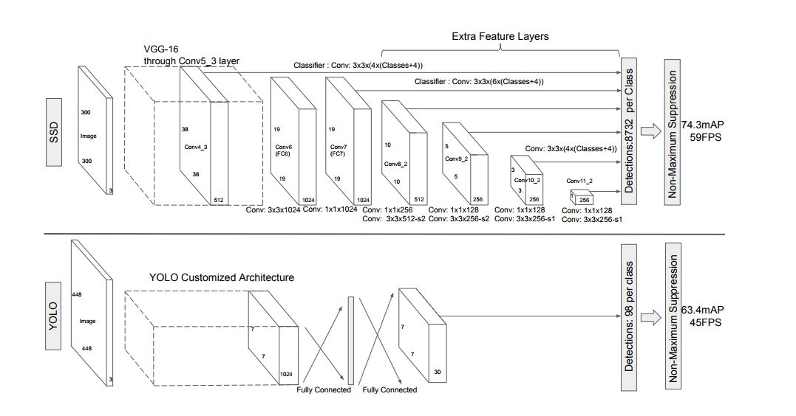
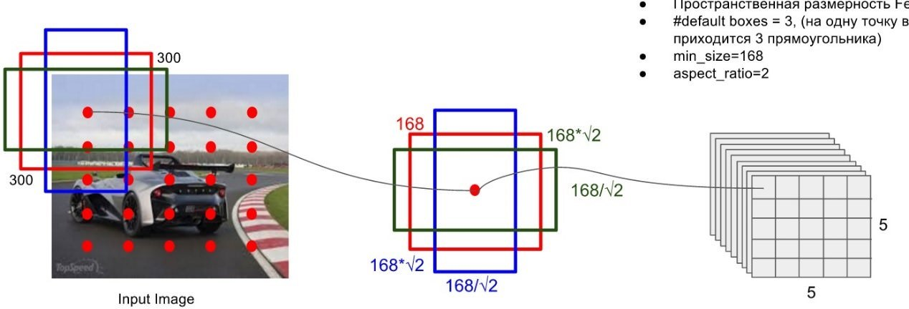
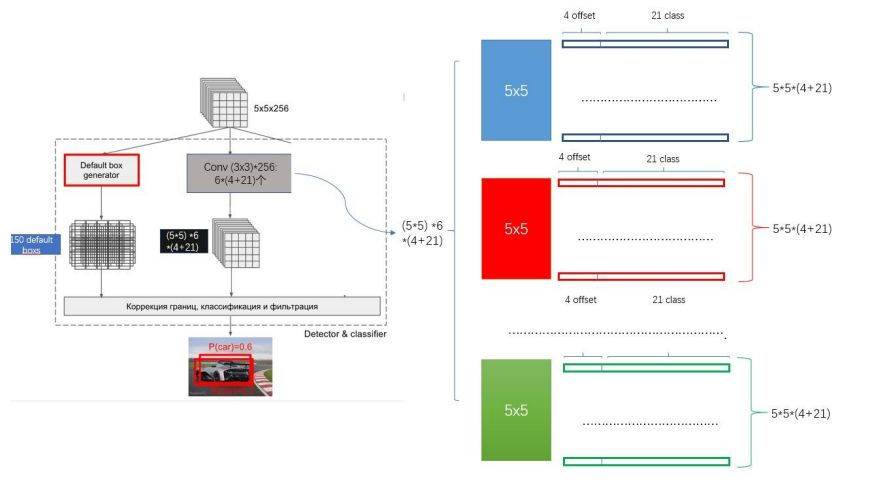
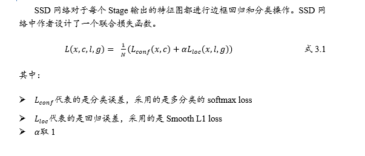
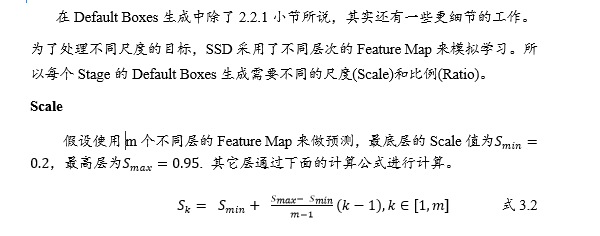
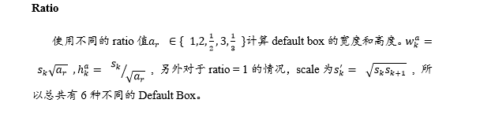

# SSD: Single Shot MultiBox Detector

基于”Proposal + Classification”的Object Detection的方法，RCNN系列(R-CNN、SPPnet、Fast R-CNN以及Faster R-CNN)取得了非常好的效果，因为这一类方法先预先回归一次边框，然后再进行骨干网络训练，所以精度要高，这类方法被称为two stage的方法。但也正是由于此，这类方法在速度方面还有待改进。由此，YOLO应运而生，YOLO系列只做了一次边框回归和打分，所以相比于RCNN系列被称为one stage的方法，这类方法的最大特点就是速度快。但是YOLO虽然能达到实时的效果，但是由于只做了一次边框回归并打分，这类方法导致了小目标训练非常不充分，对于小目标的检测效果非常的差。简而言之，YOLO系列对于目标的尺度比较敏感，而且对于尺度变化较大的物体泛化能力比较差。

针对YOLO和Faster R-CNN的各自不足与优势，WeiLiu等人提出了Single Shot MultiBox Detector，简称为SSD。SSD整个网络采取了one stage的思想，以此提高检测速度。并且网络中融入了Faster R-CNN中的anchors思想，并且做了特征分层提取并依次计算边框回归和分类操作，由此可以适应多种尺度目标的训练和检测任务。SSD的出现使得大家看到了实时高精度目标检测的可行性。

## 一、网络结构
SSD网络主体设计的思想是特征分层提取，并依次进行边框回归和分类。因为不同层次的特征图能代表不同层次的语义信息，低层次的特征图能代表低层语义信息(含有更多的细节)，能提高语义分割质量，适合小尺度目标的学习。高层次的特征图能代表高层语义信息，能光滑分割结果，适合对大尺度的目标进行深入学习。所以作者提出的SSD的网络理论上能适合不同尺度的目标检测。

所以SSD网络中分为了6个stage，每个stage能学习到一个特征图，然后进行边框回归和分类。SSD网络以VGG16的前5层卷积网络作为第1个stage，然后将VGG16中的fc6和fc7两个全连接层转化为两个卷积层Conv6和Conv7作为网络的第2、第3个stage。接着在此基础上，SSD网络继续增加了Conv8、Conv9、Conv10和Conv11四层网络，用来提取更高层次的语义信息。如下图3.1所示就是SSD的网络结构。在每个stage操作中，网络包含了多个卷积层操作，每个卷积层操作基本上都是小卷积。

骨干网络：SSD前面的骨干网络选用的VGG16的基础网络结构，如上图所示，虚线框内的是VGG16的前5层网络。然后后面的Conv6和Conv7是将VGG16的后两层全连接层网络(fc6, fc7)转换而来。

另外：在此基础上，SSD网络继续增加了Conv8和Conv9、Conv10和Conv11四层网络。图中所示，立方体的长高表示特征图的大小，厚度表示是channel。

## 二、设计要点
### 2.1. Default Boxes生成
在目标检测网络设计中，Default Boxes生成都是重中之重，也许直接决定了网络能针对的任务以及检测的性能。在SSD中，作者充分的吸取了Faster R-CNN中的Anchors机制，在每个Stage中根据Feature Map的大小，按照固定的Scale和Radio生成Default Boxes。这里为了方便阐述，选取了Conv9的Feature Map，输出大小为5x5。SSD网络中作者设置Conv9的每个点默认生成6个box，如下图所示。因此在这一层上，共生成了5x5x6=150个boxes。

### 2.2. 特征向量生成
在每张特征图上得到许多Default Box后还需要生成相应的特征向量，用来进行边框回归和分类。对于边框回归，只需要4维向量即可，分别代表边框缩放尺度(坐标轴两个方向)和平移向量(坐标轴两个方向)。对于分类，SSD网络采取为每个类别进行打分的策略，也就是说对于每个Default Box，SSD网络会计算出相应的每个类别的分数。假设数据集类别数为c，加上背景，那么总的类别数就是c+1类。SSD网络采用了c+1维向量来分别代表该Default Box对于每个类别所得到的分数。这里，假设是VOC数据集，那么每个Default Box将生成一个20 + 1 + 4 = 25维的特征向量。同样，以Conv9输出特征图5x5为例。

### 2.3. 新增卷积网络
SSD网络在VGG基础上新增加了几个卷积网络(如网络结构中所述)。SSD网络总共增加了Conv8、Conv9、Conv10和Conv11四个卷积网络层。新增的这些网络都是通过一些小的卷积核操作。引用论文所说，这些小的卷积核操作是SSD网络性能优秀的核心。下面本报告将简单的阐述一下作者对于卷积网络的简单配置。

**卷积核配置**

假设Feature Map通道数为P，SSD网络中每个Stage的卷积核大小统一为33P。其中padding和stride都为1。保证卷积后的Feature Map和卷积前是一样大小。

**卷积滤波器**

每个Feature Map上mxn个大小的特征点对应K个Default Boxes，假设类别数+背景=c，最终通过卷积滤波器得到c+4维特征向量。那么一个Feature Map上的每个点就需要使用kx(c+4)个这样的滤波器。

### 2.4. 联合LOSS FUNCTION

## 三、训练策略
训练SSD和基于region proposal方法的最大区别就是：SSD需要精确的将ground truth映射到输出结果上。这样才能提高检测的准确率。文中主要采取了以下几个技巧来提高检测的准确度。

- 匹配策略
- Default boxes生成器
- Hard Negative Mining
- Data Augmentation
### 3.1. 匹配策略
这里的匹配是指的ground truth和Default box的匹配。这里采取的方法与 Faster R-CNN中的方法类似。主要是分为两步：第一步是根据最大的overlap将ground truth和default box进行匹配(根据ground truth找到default box中IOU最大的作为正样本)，第二步是将default boxes与overlap大于某个阈值(目标检测中通常选取0.5，Faster R-CNN中选取的是0.7)的ground truth进行匹配。

### 3.2. Default Boxes生成器

### 3.3. Hard Negative Mining
经过匹配策略会得到大量的负样本，只有少量的正样本。这样导致了正负样本不平衡，经过试验表明，正负样本的不均衡是导致检测正确率低下的一个重要原因。所以在训练过程中采用了Hard Negative Mining的策略，根据Confidence Loss对所有的box进行排序，使得正负样本的比例控制在1:3之内，经过作者实验，这样做能提高4%左右的准确度。

### 3.4. Data Augmentation
为了模型更加鲁棒，需要使用不同尺度目标的输入，作者对数据进行了增强处理。

- 使用整张图像作为输入
- 使用IOU和目标物体为0.1、0.3、0.5、0.7和0.9的patch，这些patch在原图的大小的[0.1, 1]之间，相应的宽高比在[1/2, 2]之间。
- 随机采取一个patch