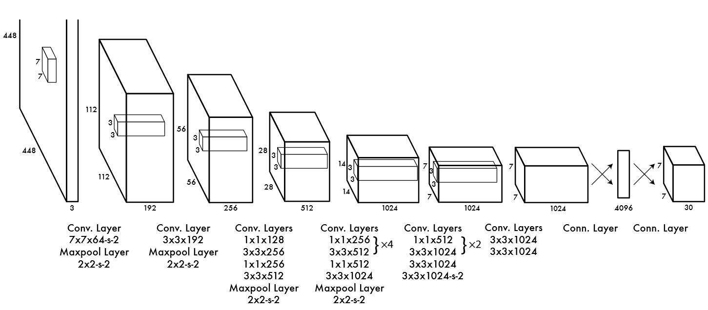
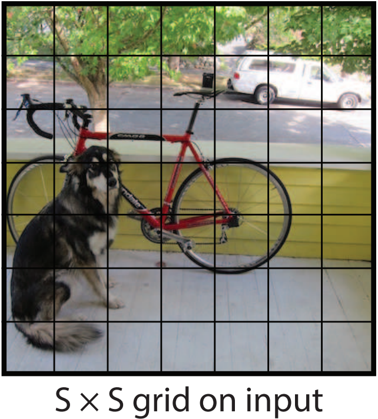
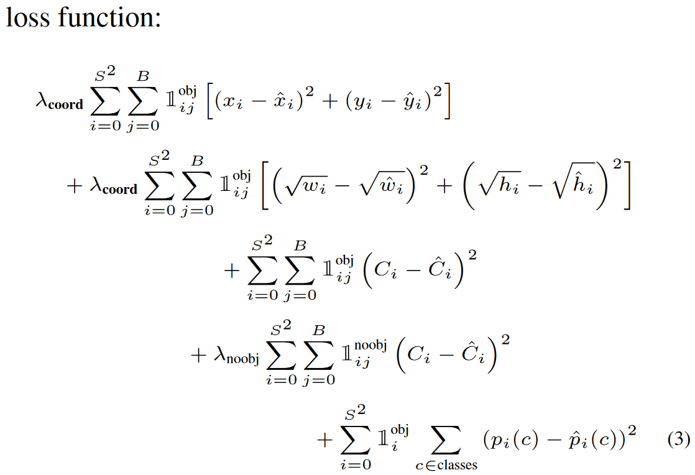

# You Only Look Once: Unified, Real-Time Object Detection

## 1. 历史意义

第一个统一的检测器，能够端到端学习。效果虽然暂时不如双阶段检测器，并且在小目标/接近目标（如鸟群）情况下检测能力较差。但速度很快。

复习一下双阶段网络。

物体检测主流的算法框架大致分为one-stage与two-stage。two-stage算法代表有R-CNN系列，one-stage算法代表有Yolo系列。按笔者理解，two-stage算法将步骤一与步骤二分开执行，输入图像先经过候选框生成网络（例如faster rcnn中的RPN网络），再经过分类网络；one-stage算法将步骤一与步骤二同时执行，输入图像只经过一个网络，生成的结果中同时包含位置与类别信息。two-stage与one-stage相比，精度高，但是计算量更大，所以运算较慢。

## 2. 模型

YOLO v1结构如下：

输入图像大小为$448\times448$，经过若干个卷积层与池化层，变为$7\times7\times1024$张量（图一中倒数第三个立方体），最后经过两层全连接层，输出张量维度为$7\times7\times30$，这就是Yolo v1的整个神经网络结构，和一般的卷积物体分类网络没有太多区别，最大的不同就是：分类网络最后的全连接层，一般连接于一个一维向量，向量的不同位代表不同类别，而这里的输出向量是一个三维的张量$（7\times7\times30）$。上图中Yolo的backbone网络结构，受启发于GoogLeNet，也是v2、v3中Darknet的先锋。本质上来说没有什么特别，没有使用BN层，用了一层Dropout。除了最后一层的输出使用了线性激活函数，其他层全部使用Leaky Relu激活函数。网络结构没有特别的东西，不再赘述。

**解释一下输出张量维度的意义**

(1) $7\times7$的含义

$7\times7$是指图片被分成了$7\times7$个格子，如下所示：

在Yolo中，如果一个物体的中心点，落在了某个格子中，那么这个格子将负责预测这个物体。这句话怎么理解，用上图举例，设左下角格子假设坐标为 (1,1)，小狗所在的最小包围矩形框的中心，落在了 (2,3)这个格子中。那么$7\times7$个格子中，(2,3) 这个格子负责预测小狗，而那些没有物体中心点落进来的格子，则不负责预测任何物体。这个设定就好比该网络在一开始，就将整个图片上的预测任务进行了分工，一共设定$7\times7$个按照方阵列队的检测人员，每个人员负责检测一个物体，大家的分工界线，就是看被检测物体的中心点落在谁的格子里。当然，是$7\times7$还是$9\times9$，是上图中的参数S，可以自己修改，精度和性能会随之有些变化。

(2) 30的含义刚才设定了49个检测人员，那么每个人员负责检测的内容，就是这里的30（注意，30是张量最后一维的长度）。在Yolo v1论文中，30是由 $(4+1)∗2+20$得到的。其中4+1是矩形框的中心点坐标 x,y，长宽 w,以及是否属于被检测物体的置信度c；2是一个格子共回归两个矩形框，每个矩形框分别产生5个预测值（ x,y,w,h,c)；20代表预测20个类别。这里有几点需要注意：1. 每个方格（grid） 产生2个预测框，2也是参数，可以调，但是一旦设定为2以后，那么每个方格只产生两个矩形框，最后选定置信度更大的矩形框作为输出，也就是最终每个方格只输出一个预测矩形框。2. 每个方格只能预测一个物体。虽然可以通过调整参数，产生不同的矩形框，但这只能提高矩形框的精度。所以当有很多个物体的中心点落在了同一个格子里，该格子只能预测一个物体。也就是格子数为$7\times7$时，该网络最多预测49个物体。

## 3. 损失函数

看到这里读者或许会有疑问，Yolo里的每个格点，是怎么知道该预测哪个物体的？这就是神经网络算法的能力。首先拿到一批标注好的图片数据集，按照规则打好标签，之后让神经网络去拟合训练数据集。训练数据集中的标签是通过人工标注获得，当神经网络对数据集拟合的足够好时，那么就相当于神经网络具备了一定的和人一样的识别能力。神经网络结构确定之后，训练效果好坏，由Loss函数和优化器决定。Yolo v1使用普通的梯度下降法作为优化器。这里重点解读一下Yolo v1使用的Loss函数：

论文中Loss函数，密密麻麻的公式初看可能比较难懂。其实论文中给出了比较详细的解释。所有的损失都是使用平方和误差公式，暂时先不看公式中的$\lambda_{coord}$  与 $\lambda_{noobj}$  ，输出的预测数值以及所造成的损失有:

1. 预测框的中心点 (x, y) 。造成的损失是图五中的第一行。其中 $1^{obj}_{ij}$ 为控制函数，在标签中包含物体的那些格点处，该值为 1 ；若格点不含有物体，该值为 0。也就是只对那些有真实物体所属的格点进行损失计算，若该格点不包含物体，那么预测数值不对损失函数造成影响。(x, y) 数值与标签用简单的平方和误差。
2. 预测框的宽高 (w, h) 。造成的损失是图五的第二行。$1^{obj}_{ij}$的含义一样，也是使得只有真实物体所属的格点才会造成损失。这里对 (w, h) 在损失函数中的处理分别取了根号，原因在于，如果不取根号，损失函数往往更倾向于调整尺寸比较大的预测框。例如，20个像素点的偏差，对于$800\times600$的预测框几乎没有影响，此时的IOU数值还是很大，但是对于$30\times40$的预测框影响就很大。取根号是为了尽可能的消除大尺寸框与小尺寸框之间的差异。
3. 第三行与第四行，都是预测框的置信度C。当该格点不含有物体时，该置信度的标签为0；若含有物体时，该置信度的标签为预测框与真实物体框的IOU数值（IOU计算公式为：两个框交集的面积除以并集的面积）。
4. 第五行为物体类别概率P，对应的类别位置，该标签数值为1，其余位置为0，与分类网络相同。此时再来看 $\lambda_{coord}$  与 $\lambda_{noobj}$  ，Yolo面临的物体检测问题，是一个典型的类别数目不均衡的问题。其中49个格点，含有物体的格点往往只有3、4个，其余全是不含有物体的格点。

此时如果不采取点措施，那么物体检测的mAP不会太高，因为模型更倾向于不含有物体的格点。$\lambda_{coord}$  与 $\lambda_{noobj}$ 的作用，就是让含有物体的格点，在损失函数中的权重更大，让模型更加“重视”含有物体的格点所造成的损失。在论文中，$\lambda_{coord} $ 与$\lambda_{noobj}$  的取值分别为5与0.5。

**一些技巧**

1. 回归offset代替直接回归坐标

We parametrize the bounding box x and y coordinates to be offsets of a particular grid cell location so they are also bounded between 0 and 1 

(x, y) 不直接回归中心点坐标数值，而是回归相对于格点左上角坐标的位移值。例如，第一个格点中物体坐标为 (2.3, 3.6) ，另一个格点中的物体坐标为(5.4, 6.3)，这四个数值让神经网络暴力回归，有一定难度。所以这里的offset是指，既然格点已知，那么物体中心点的坐标一定在格点正方形里，相对于格点左上角的位移值一定在区间[0, 1)中。让神经网络去预测(0.3, 0.6) 与(0.4, 0.3) 会更加容易，在使用时，加上格点左上角坐标(2, 3)、(5, 6)即可。

2. 同一格点的不同预测框有不同作用

At training time we only want one bounding box predictor to be responsible for each object. We assign one predictor to be “responsible” for predicting an object based on which prediction has the highest current IOU with the ground truth. This leads to specialization between the bounding box predictors. Each predictor gets better at predicting certain sizes, aspect ratios, or classes of object, improving overall recall. 

前文中提到，每个格点预测两个或多个矩形框。此时假设每个格点预测两个矩形框。那么在训练时，见到一个真实物体，我们是希望两个框都去逼近这个物体的真实矩形框，还是只用一个去逼近？或许通常来想，让两个人一起去做同一件事，比一个人做一件事成功率要高，所以可能会让两个框都去逼近这个真实物体。但是作者没有这样做，在损失函数计算中，只对和真实物体最接近的框计算损失，其余框不进行修正。这样操作之后作者发现，一个格点的两个框在尺寸、长宽比、或者某些类别上逐渐有所分工，总体的召回率有所提升。

3. 使用非极大抑制生成预测框

However, some large objects or objects near the border of multiple cells can be well localized by multiple cells. Non-maximal suppression can be used to fix these multiple detections. While not critical to performance as it is for R-CNN or DPM, non-maximal suppression adds 2 - 3% in mAP. 

通常来说，在预测的时候，格点与格点并不会冲突，但是在预测一些大物体或者邻近物体时，会有多个格点预测了同一个物体。此时采用非极大抑制技巧，过滤掉一些重叠的矩形框。但是mAP提升并没有显著提升。（非极大抑制，物体检测的老套路，这里不再赘述）

4. 推理时将$p\times c$ 作为输出置信度
 
$$Pr(Class_i|Object) ∗ Pr(Object) ∗ IOU^{truth}_{pred} = \\ Pr(Class_i) ∗ IOU^{truth}_{pred} \tag{1}$$
 
在推理时，使用物体的类别预测最大值p 乘以 预测框的最大值 c ，作为输出预测物体的置信度。这样也可以过滤掉一些大部分重叠的矩形框。输出检测物体的置信度，同时考虑了矩形框与类别，满足阈值的输出更加可信。

